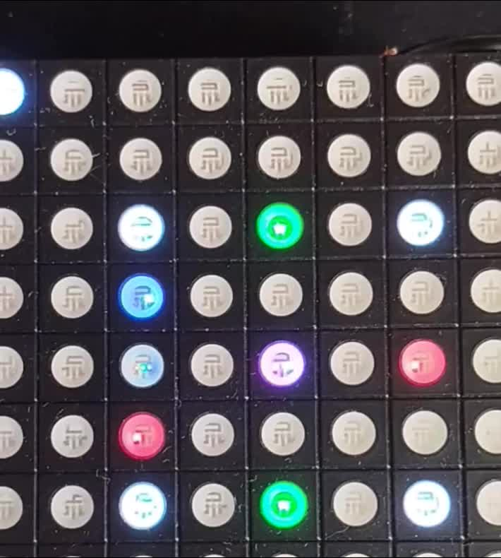

# qpc-arduino-avr
## QP/C port and examples running on AVR aduinos like Arduino Pro Mini, Colorduino, ...

### Installation
Install into &lt;sketch location&gt;/libraries

### Example : Dining Philosopher Problem on Colorduino
Depends on Colorduino library (https://github.com/lincomatic/Colorduino)

